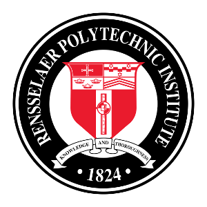
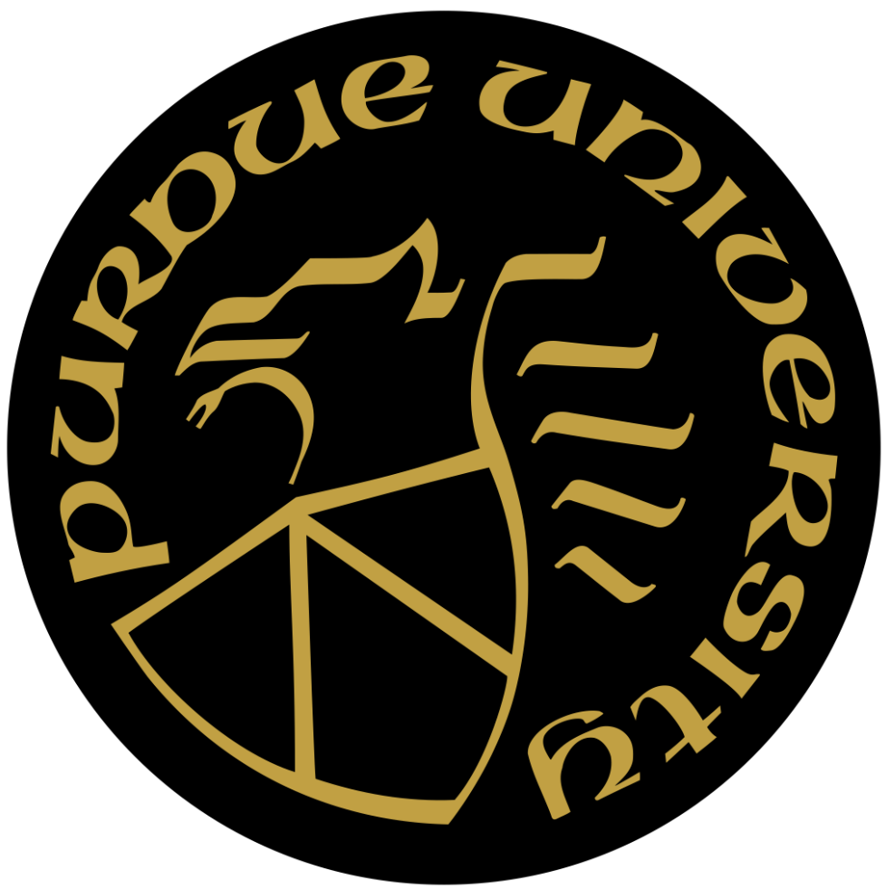

I help software companies and teams realize the value of complex
software technologies by aligning strategy, teamwork, and developer
tools.

After graduating Purdue University with a BS in Computer Science, I
joined General Electric to attend their three year Software Technology
Program at GE's Corporate R&D (CRD) center (now GE Global Research) in
Schenectady, NY. The program consisted of corporate training in Software
Engineering followed by three year-long assignments working within
R&D groups at CRD. I built a programming language (Omega Lisp) for GE's
Cross-Omega Connection Machine (massively parallel computing system); I
developed IDE software for an Ada workstation; I developed software for
image processing pipelines for non-destructive X-Ray evaluation of GE
Aircraft Engine turbine blades. GE also funded my graduate study in
Computer Science at RPI, where I earned a MS in CS while working full
time at GE CRD. Those projects instilled my strong desire for building
developer tooling to make software <developers|development> better,
stronger, faster.

After completing the program at GE, I worked briefly at Data General in
Research Triangle Park, NC, building workstation software for a DG
AViiON desktop workstation.

In 1989, I joined SAS as a software developer. There, I rewrote the
SAS/CALC spreadsheet formula interpreter for SAS' multi-vendor
architecture (PL/1 -> POSIX C), adding capabilities to build
3-dimensional spreadsheets. I was soon promoted and I managed the team
which built the SAS webAF Java IDE, and created object-oriented and list
data structure libraries for SAS Control Language. When SAS adopted Java
in 1996, I became the local Java expert and was appointed as R&D Java
Strategist to run the Java Technology Board (JTB), helping the company
widely adopt and succeed with the Java Platform. The JTB established
corporate Java standards, processes, and tools. I later joined the
Advanced Computing Lab as a founding member, researching advanced high
performance programming languages and building a high performance
multi-dimensional data server. I implemented an MDX parser and a
multi-dimensional search library implementation of a Patricia TRIE to
enable scalable multi-dimensional search features.

During my tenure, I organized a peer-led technical book study program in
SAS R&D, studying books such as _Design Patterns_, _Java Patterns_, _Java
Puzzlers_, _The Structure and Interpretation of Computer Programs_.

When SAS began digital transformation to a web API-based architecture, I
was a founding member of the SAS Technology Office (SAS' enterprise
architecture team) and founded the SAS API Center of Excellence, which
helped SAS migrate to REST APIs and a resource-oriented architecture.
The CoE defined SAS' REST standards, style guide, and provided API
design expertise for SAS' product teams. I led the CoE for 5+ years,
during which SAS delivered over 120 APIs while modernizing their web
application-based products. I also created and developed SAS' API
Developer Portal.

Around 2010, I helped found a grassroots effort within SAS R&D to improve
developer productivity. I created saspedia (and built it with WikiMedia
software) to house SAS' internal documentation, and was primary
evangelist and editor for 7 years. I helped create guidelines for
content authoring, naming, structure, categorization, linking, and
taxonomies. Seven years later, saspedia had close to 30,000
entries, documenting everything from products, people, and teams, to
tools, standards, and processes. saspedia was one of the most used
resources across R&D's 1800+ staff.

In 2017, I accepted an opportunity to create and lead the API program for
a new startup, Apiture, which aimed to create open banking APIs in the
US. I joined as a Principal API Architect and was soon promoted to VP,
API Platforms, and in 2021, Apiture created the Chief API Officer role,
which I have held since. In creating the API program, I established a
core set of API design principles, the Apiture API Style Guide, and an
API Design Patterns catalog, and began evangelizing an API First
approach to building the Apiture platform. I created a portfolio of
developer tools to accelerate the design of Apiture's APIs
(openapi-templates, openapi-lint, openapi-dependencies, openapi-version,
openapi-annotations, api-doc). I managed the API First Office. I created
and published Apiture's Developer Portal. I also established _API
University_ and designed and presented training programs on many aspects
of APIs (architecture, design, HTTP and related standards,
contract-based testing). I later morphed API University into the broader
_Apiture University_ to allow more teams to collaborate and share
knowledge. Apiture University provides a vehicle for people to grow
professionally.

I built a successful API program at Apiture. I have been invited to speak at numerous
conferences and podcasts about APIs, gaining recognition
as an API industry expert and thought leader. See [Thought Leadership](more)
for some of my appearances.

## Education

<table border="0" cellspacing="0" cellpadding="0">

<tr>
<td></td>
<td>Rensselaer Polytechnic Institute (RPI)</td>
<td>Master of Science, Computer Science</td>
<td>1985-1988</td>
</tr>

<tr>
<td></td>
<td>Purdue University</td>
<td>Bachelor of Science, Computer Science</td>
<td>1981-1985</td>
</tr>

</table>
