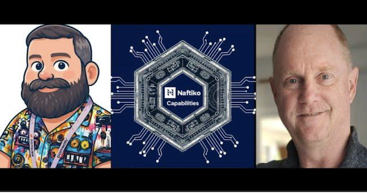
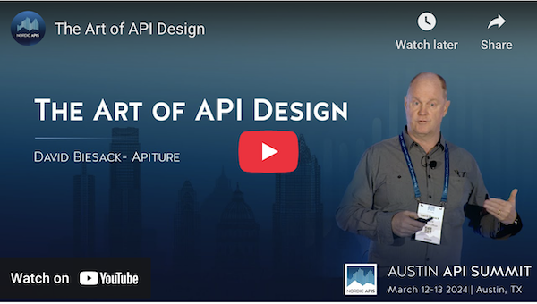
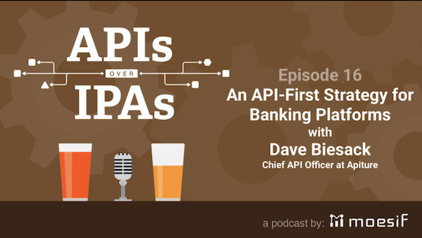
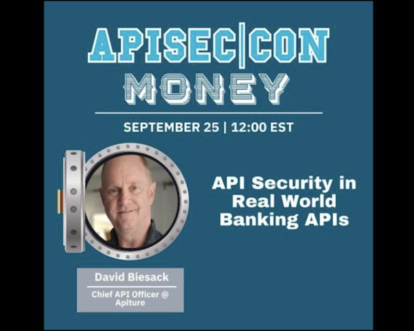

Below is a sampling of my appearances at conferences or in
podcasts/vidcasts/interviews.

See also [About Me](/about-me) for what my peers have written about me.
>
## [Naftiko Capabilities Podcast for January 20th, 2026 - Advanced JSON Schema and OpenAPI](https://www.youtube.com/watch?v=nWYlbuoqBAY)

> Kin Lane and I chatted about using JSON Schema effectively within APIs
> described with OpenAPI, and how JSON Schema and OpenAPI Specification
> Extensions help add capabilities to OpenAPI.

## [Behind the API with David Biesack | Shane O'Connor](https://www.linkedin.com/feed/update/urn:li:activity:7393950763816742912?lipi=urn%3Ali%3Apage%3Ad_flagship3_profile_view_base_single_media_viewer_details_modal%3BmFdw1Qp7SIGLarnbYY03nA%3D%3D)

> Shane O'Connor from Scalar invited me to talk about APIs, APIs as a
> Product, API Governance, and more on his Behind the API seriesShane
> O'Connor from Scalar invited me to talk about APIs, APIs as a Product,
> API Governance, and more on his Behind the API series

## [Is API Design an Art?](https://nordicapis.com/is-api-design-an-art/)

> I spoke at the
> 2024 Nordic APIs Austin API Summit conference: [The Art of API Design](https://www.youtube.com/watch?v=-Da3zHWXXko).
> Nordic APIs' published an article about my presentation,
> [_Is API Design an Art_](https://nordicapis.com/is-api-design-an-art/), discussing the interplay of art and
> science in the task of designing APIs.

## [APIs Over IPAs 16: API-First Strategy for Banking Platforms with Dave Biesack](https://www.moesif.com/blog/podcasts/developers/Podcast-APIs-Over-IPAs-API-First-Strategy-for-Banking-Platforms-with-Dave-Biesack/)

> I was a guest on Moesif's API podcast where we chatted about APIs and
> building the API program at Apiture.

## [APISEC|CON MONEY: API Security in Real World Banking APIs](https://www.youtube.com/watch?v=MHozyZJKQRE)

> My _API Security in Real World Banking APIs_ presentation at the
> APISEC|CON MONEY conference, Sept 25 2024.

## [Why You Might Need a Chief API Officer](https://nordicapis.com/why-you-might-need-a-chief-api-officer/)

> Nordic APIs published an article informing companies why they should
> consider staffing a position, such as a Chief API Officer, to manage
> the difficult task of creating secure, well-built APIs.

## API Design Matters&trade;

In early 2023, I began writing
[_API Design Matters_&trade;](https://apidesignmatters.org)
where I explore API Design and Developer Experience matters large and
small, topics around building and running API programs... that is, why
API Design Matters. I initially published _API Design Matters_ on Substack.

I have since learned that [Substack has ethical issues](https://leavesubstack.com), so I have
[stopped writing there](https://apidesignmatters.substack.com/p/api-design-matters-is-moving)
and moved all the content to
[apidesignmatters.org](https://apidesignmatters.org).

## Agent Experience (AX)

> In today's world of AI-powered agents, APIs are more important than ever.

A product manager from an Apiture competitor asked
[_Claude by Anthropic_](https://chat.chatbot.app/claude)
which online banking provider has the best APIs
and shared the below response with David via LinkedIn.
(_David did not independenly verify this content with Claude._)

> _Apiture was the winner across the board for public API documentation. The key points from that analysis:_
>
> _Format & machine-readability &mdash; Apiture publishes every API as a downloadable OpenAPI spec in YAML or JSON. That's the industry-standard format Cursor, Postman, Swagger UI, and AI coding assistants can ingest directly. No human translation needed._
>
> _Breadth &mdash; Apiture publicly documents 20+ distinct APIs covering the full digital banking stack: customer-facing (Accounts, Transactions, Transfers, Cards, Customers, Products, Challenges, Disputes), admin/back-office (Accounts Admin, Customers Admin, Events Admin, Business Transfers Admin, Banking Account Applications Admin, etc.), marketing/analytics (Ad Campaigns, Customer Audiences, Data Analytic Filters), and infrastructure (Platform Encryption, Institutions)._
>
> _Getting started &mdash; Fully public conceptual documentation covering API keys, OAuth 2.0, OpenID Connect with PKCE, access tokens, scopes, error types, pagination, filtering, and idempotent operations &mdash; all readable without logging in. Plus step-by-step guides like "Authenticate Users," "Getting a List of Accounts," and "Creating a One-Time Transfer."_

(__Note__: David was the principle API architect and Chief API Officer
behind Apiture's Digital Banking APIs and Developer Experience from 2017-2026._)

## More

To discover more about me, my thought leadership, and my technical
communication style, please see my
[__Featured__ articles](https://www.linkedin.com/in/davidbiesack/details/featured/), and
__[About Me](/about-me)__ for what my peers have written about me
(extracted from
[__Recommendations__](https://www.linkedin.com/in/davidbiesack/details/recommendations/)
on LinkedIn).
