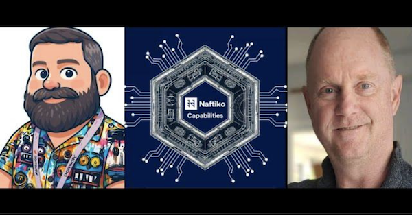
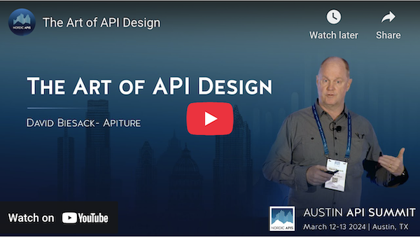
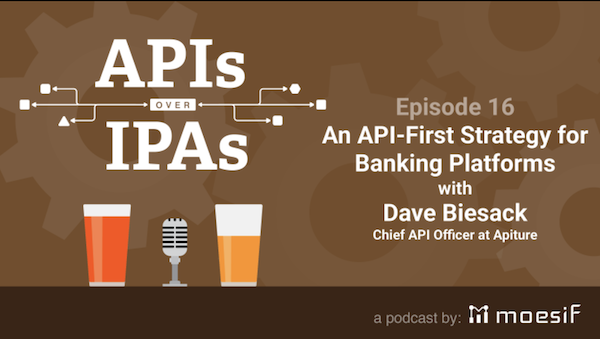
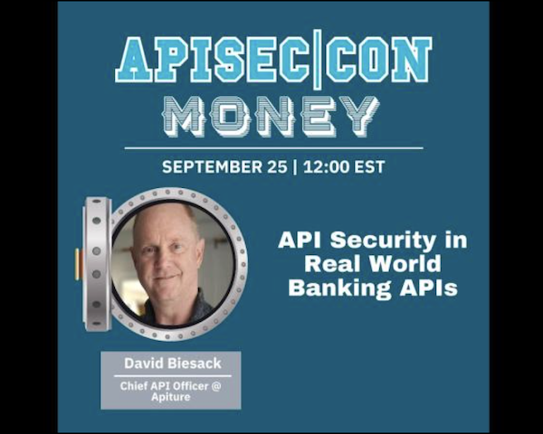

Below is a sampling of my recent appearances on podcasts/vidcasts.

### [Naftiko Capabilities Podcast for January 20th, 2026 - Advanced JSON Schema and OpenAPI](https://www.youtube.com/watch?v=nWYlbuoqBAY)

> Kin Lane and I chatted about using JSON Schema effectively within APIs
> described with OpenAPI, and how JSON Schema and OpenAPI Specification
> Extensions help add capabilities to OpenAPI.

### [Behind the API with David Biesack | Shane O'Connor](https://www.linkedin.com/feed/update/urn:li:activity:7393950763816742912?lipi=urn%3Ali%3Apage%3Ad_flagship3_profile_view_base_single_media_viewer_details_modal%3BmFdw1Qp7SIGLarnbYY03nA%3D%3D)

> Shane O'Connor from Scalar invited me to talk about APIs, APIs as a
> Product, API Governance, and more on his Behind the API seriesShane
> O'Connor from Scalar invited me to talk about APIs, APIs as a Product,
> API Governance, and more on his Behind the API series

### [Is API Design an Art?](https://nordicapis.com/is-api-design-an-art/)

> I spoke at the
> 2024 Nordic APIs Austin API Summit conference: [The Art of API Design](https://www.youtube.com/watch?v=-Da3zHWXXko).
> Nordic APIs' published an article about my presentation,
> [_Is API Design an Art_](https://nordicapis.com/is-api-design-an-art/), discussing the interplay of art and
> science in the task of designing APIs.

### [APIs Over IPAs 16: API-First Strategy for Banking Platforms with Dave Biesack](https://www.moesif.com/blog/podcasts/developers/Podcast-APIs-Over-IPAs-API-First-Strategy-for-Banking-Platforms-with-Dave-Biesack/)

> I was a guest on Moesif's API podcast where we chatted about APIs and
> building the API program at Apiture.

### [APISEC|CON MONEY: API Security in Real World Banking APIs](https://www.youtube.com/watch?v=MHozyZJKQRE)

> My _API Security in Real World Banking APIs_ presentation at the
> APISEC|CON MONEY conference, Sept 25 2024.

### [Why You Might Need a Chief API Officer](https://nordicapis.com/why-you-might-need-a-chief-api-officer/)

> Nordic APIs published an article informing companies why they should
> consider staffing a position, such as a Chief API Officer, to manage
> the difficult task of creating secure, well-built APIs.

### API Design Matters

In early 2023, I began writing
[_API Design Matters_](https://apidesignmatters.substack.com)
where I explore API Design and Developer Experience matters large and
small, topics around building and running API programs... that is, why
API Design Matters.

(I have since learned that [Substack has ethical issues](https://leavesubstack.com), so I have
[stopped writing there)(https://apidesignmatters.substack.com/p/api-design-matters-is-moving).
I have not yet found a suitable
replacement for it, so I have not hosted it elsewhere.... yet)

### More...

To discover more about me, my thought leadership, and my technical
communication style, please see my
[__Featured__ articles](https://www.linkedin.com/in/davidbiesack/details/featured/)
and
[__Recommendations__](https://www.linkedin.com/in/davidbiesack/details/recommendations/)
on LinkedIn.

Note: I used to participate X (formerly Twitter) but stopped using that site in
2022, also for ethical reasons.
([@davidbiesack](https://x.com/davidbiesack) if your wish to view my
prior posts).
